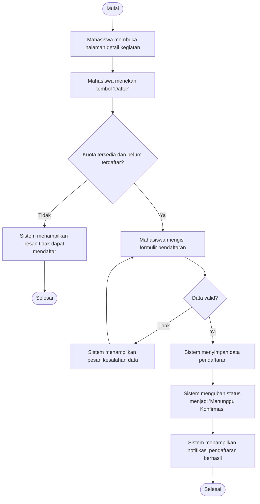
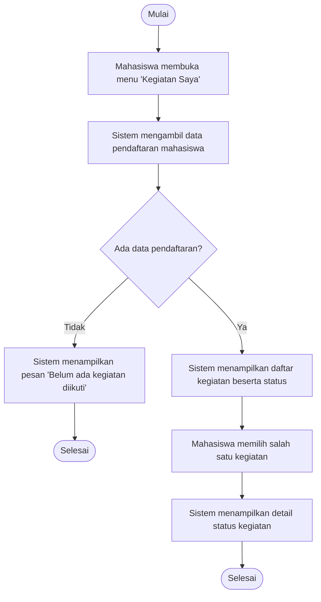
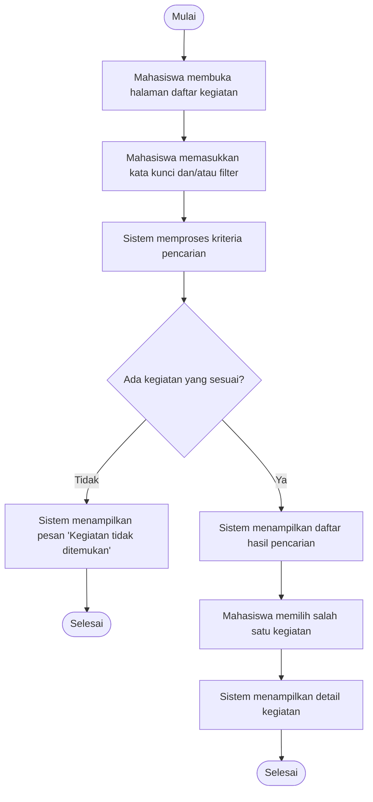
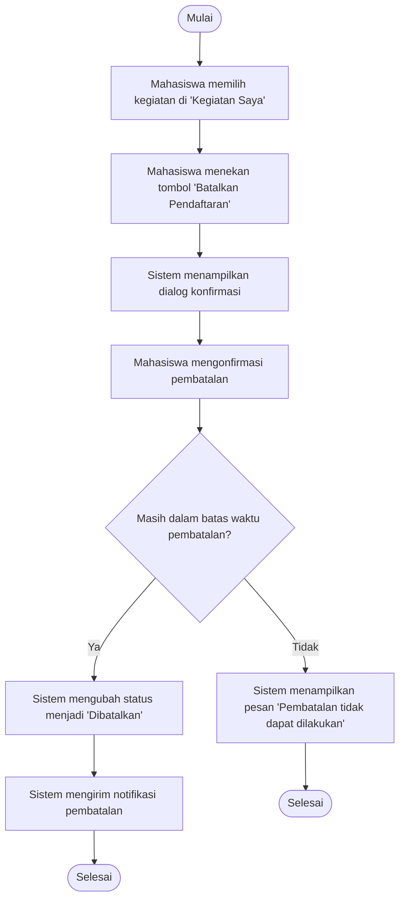

# Use Case Sisi Mahasiswa — Pendaftaran Kegiatan Sukarelawan

**Bagian tugas:** Use Case sisi Mahasiswa B
**Cakupan:** Linear Sequence Form + Activity Diagram
**Aktor:** Mahasiswa
**Konteks aplikasi:** Platform untuk mencari dan mendaftar ke kegiatan/event sukarelawan.

> Selain 2 use case yang disebutkan secara eksplisit (Mendaftar Kegiatan, Melihat Status/Pendaftaran), saya menambahkan **Mencari Kegiatan** dan **Membatalkan Pendaftaran** sebagai use case partisipasi mahasiswa lainnya, karena keduanya melengkapi alur penuh (cari → daftar → pantau status → batalkan bila perlu). Kalau kelompok/dosen sudah punya daftar use case lain yang lebih spesifik, kabari saja dan bagian ini bisa disesuaikan.

---

## 1. Use Case: Mendaftar Kegiatan

**Deskripsi singkat:** Mahasiswa memilih sebuah kegiatan sukarelawan dan mendaftarkan diri untuk berpartisipasi.

### Linear Sequence Form

| No | Aksi Mahasiswa | Respon Sistem |
|----|----------------|---------------|
| 1 | Membuka halaman detail kegiatan yang ingin diikuti | Menampilkan informasi kegiatan (nama, deskripsi, jadwal, kuota, syarat) |
| 2 | Menekan tombol "Daftar" | Memeriksa status login, kuota kegiatan, dan apakah mahasiswa sudah pernah terdaftar |
| 3 | Mengisi formulir pendaftaran (jika ada data tambahan) dan mengirimkan | Memvalidasi data formulir |
| 4 | — | Jika data valid: menyimpan pendaftaran dan mengubah status menjadi "Menunggu Konfirmasi" |
| 5 | — | Menampilkan notifikasi bahwa pendaftaran berhasil dikirim |
| 5a | — | *(Alternatif)* Jika kuota penuh / sudah terdaftar / data tidak valid: menampilkan pesan bahwa pendaftaran tidak dapat diproses |

### Activity Diagram

---

## 2. Use Case: Melihat Status/Pendaftaran

**Deskripsi singkat:** Mahasiswa memantau status dari kegiatan-kegiatan yang telah ia daftarkan.

### Linear Sequence Form

| No | Aksi Mahasiswa | Respon Sistem |
|----|----------------|---------------|
| 1 | Membuka menu "Kegiatan Saya" / "Riwayat Pendaftaran" | Mengambil seluruh data pendaftaran milik mahasiswa dari basis data |
| 2 | — | Menampilkan daftar kegiatan yang diikuti beserta status masing-masing (Menunggu, Diterima, Ditolak, Selesai) |
| 3 | Memilih salah satu kegiatan dari daftar | Mengambil detail data dan status terkini kegiatan tersebut |
| 4 | — | Menampilkan halaman detail status (jadwal, lokasi, catatan tambahan, riwayat perubahan status) |

### Activity Diagram

---

## 3. Use Case: Mencari Kegiatan

**Deskripsi singkat:** Mahasiswa menelusuri atau mencari kegiatan sukarelawan yang tersedia berdasarkan kata kunci atau filter tertentu.

### Linear Sequence Form

| No | Aksi Mahasiswa | Respon Sistem |
|----|----------------|---------------|
| 1 | Membuka halaman utama/daftar kegiatan | Menampilkan daftar seluruh kegiatan yang tersedia |
| 2 | Memasukkan kata kunci dan/atau memilih filter (kategori, lokasi, tanggal) | Memproses kriteria pencarian |
| 3 | — | Menampilkan daftar kegiatan yang sesuai dengan kriteria pencarian |
| 4 | Memilih salah satu kegiatan dari hasil pencarian | Menampilkan halaman detail kegiatan tersebut |

### Activity Diagram

---

## 4. Use Case: Membatalkan Pendaftaran

**Deskripsi singkat:** Mahasiswa membatalkan partisipasinya pada kegiatan yang sebelumnya sudah ia daftarkan.

### Linear Sequence Form

| No | Aksi Mahasiswa | Respon Sistem |
|----|----------------|---------------|
| 1 | Membuka menu "Kegiatan Saya" dan memilih kegiatan yang ingin dibatalkan | Menampilkan detail kegiatan beserta opsi "Batalkan Pendaftaran" |
| 2 | Menekan tombol "Batalkan Pendaftaran" | Menampilkan dialog konfirmasi pembatalan |
| 3 | Mengonfirmasi pembatalan | Memeriksa apakah pembatalan masih diperbolehkan (mis. sebelum batas waktu tertentu) |
| 4 | — | Jika diperbolehkan: mengubah status pendaftaran menjadi "Dibatalkan" dan mengirim notifikasi |
| 4a | — | *(Alternatif)* Jika melewati batas waktu: menampilkan pesan bahwa pembatalan tidak dapat dilakukan |

### Activity Diagram

